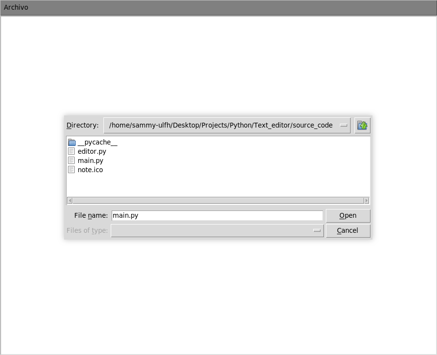

# Editor de texto

    

Esta es una aplicación óptima para la edición y creación de archivos de texto, ya que gracias a la implementación de la capacidad de manipular archivos, así como módulos de tkinter se creó una aplicación completa que permite la creación, edición y almacenado de archivos.

La implementación utiliza POO , los módulos **filedialog** y **messagebox**, así como el widget **Text** y **Menu** brindan el funcionamiento básico que cualquier editor de texto nos permite.

Finalmente, se utilizó la herramienta *auto-py-to-exe* para permitir generar un ejecutable directo para Windows, tal como una aplicación portable, así como para Linux, ubicadas en la carpeta [App](./App/).

## Tabla de contenidos

- [Funcionamiento](#Funcionamiento)
- [Explicación del código](#Explicación-del-código)

## Funcionamiento

1. **Abrir un archivo**:

    Gracias a la opción **Abrir** que se encuentra en el menú superior, nos abrirá una ventana la cual nos permitirá navegar entre los directorios de nuestro sistema y seleccionar cualquier archivo de texto para poder editarlo.

    Bastará con seleccionar alguno y darle en **open**:

    

         
    

    Finalmente, veremos como esto nos carga el contenido del archivo y podremos editarlo sin problemas:

    

        
    

2. **Guardar un archivo**:

    Podremos almacenar cualquier cosa que hayamos editado en algún archivo, para no perder los cambios realizados.

    Si aún no contamos con un archivo que hayamos abierto, será como tener un nuevo archivo, por lo que nos abrirá una ventana para seleccionar un directorio y darle un nombre para almacenarlo:

    

        
    

    En caso de ser un archivo que hayamos abierto o ya hayamos guardado antes, al presionar guardar, automáticamente se guardaran los cambios, ya que la aplicación ya sabría con qué archivo está trabajando actualmente.

3. **Crear un nuevo archivo**:

    Para un nuevo archivo, lo que hace la aplicación es simplemente dejarnos la entrada de texto vacía y el sistema quedarse sin saber con qué archivo se está trabajando actualmente, por ende al presionar en **Guardar**, nos pedirá la información correspondiente para darle un nombre y almacenarlo donde deseemos.

4. **Cerrar la aplicación**:

    Si bien, dependiendo de en que entorno sea ejecutada ya podrá tener en la parte superior los 3 botones principales que traen la mayoría de aplicaciones para *cerrar*, *minimizar* o *agrandar* la aplicación.

    Se agregó dentro de la propia aplicación una posibilidad de que el usuario le dé a *Salir*, lo cual lanzara una ventana que pedirá una confirmación para cerrar o no la aplicación:

    

        
    

## Explicación del código

1. **Archivo "editor.py"**

    **Contenido de la clase SimpleTextEditor:**

    - **Constructor (__init__):** Nuestro constructor tiene en cuenta principalmente que recibirá como parámetro la ventana principal de nuestra aplicación, es por ello que dentro del propio constructor además se crea el área de edición del texto, la cual se muestra directamente en nuestra aplicación con las proporciones correctas. Además, se crea la propiedad **current_open_file**, para que cuando se abra o almacene un archivo, siempre sepa con cuál archivo se está trabajando para ser de apoyo al realizar los cambios cuando se quieran almacenar.
     
    - **Método new_file:** El método **new_file** únicamente se encarga de limpiar toda la entrada de texto que visualiza el usuario y reasignar nuestra propiedad **current_open_file** a una cadena vacía, para que al querer almacenarlo pregunte la información para saber con qué nuevo archivo se trabajara.
     
    - **Método open_file:** Este método inicia trabajando con el módulo **filedialog** de tkinter. Primeramente, se utiliza el método *askopenfilename()* para solicitar al usuario el archivo que quiere abrir, si es seleccionado uno se almacenará la ruta absoluta del archivo y se carga el contenido en el widget **Text** con el método **insert**, si no se selecciona algún archivo el método no retornará nada y por ende sale de la función.
     
    - **Método save_file:** Este método utiliza la propiedad **current_open_file**, donde si se ha abierto un archivo, sabrá con qué archivo está trabajando y automáticamente almacenará el contenido, pero si esta propiedad está vacía quiere decir que es un archivo nuevo, por lo que con uso de **filedialog** y el método **asksaveasfilename()** solicita al usuario la ruta y el nombre de como se almacenará, de ser proporcionada la información almacenará el archivo, de lo contrario saldrá de la función.
     
    - **Método quit_confirm:** Este método utiliza el módulo **messagebox** de tkinter, donde se utiliza el método **askokcancel()**, donde el usuario decide si realmente quiere salir de la aplicación o no, de presionar **ok** el programa recibe un **True** que se verifica con un condicional y destruirá la sesión o ventana de la aplicación, cerrándola automáticamente. De lo contrario su ejecución seguirá igual.
